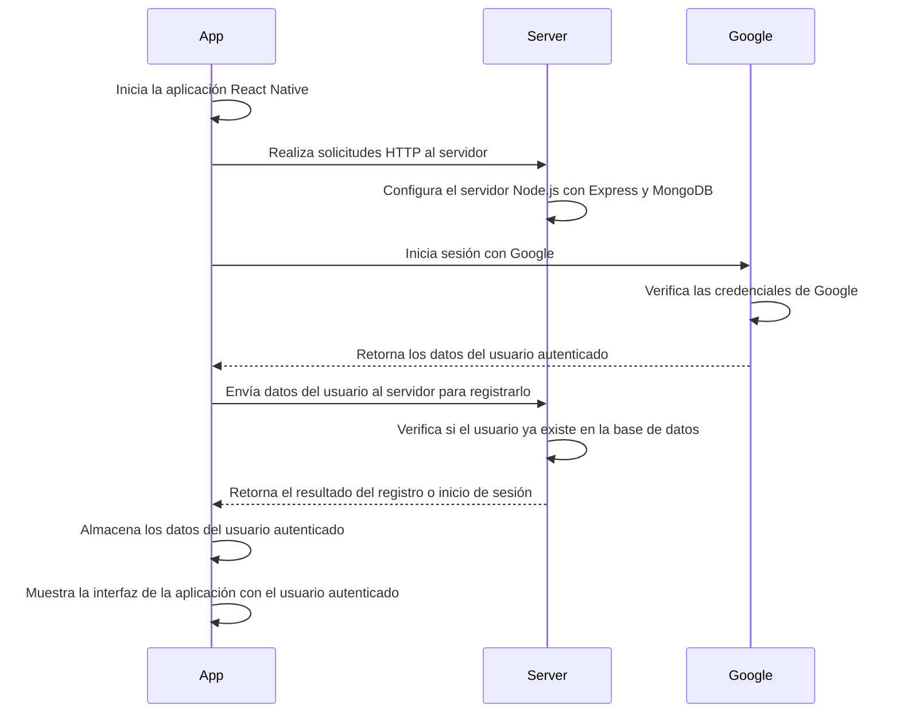
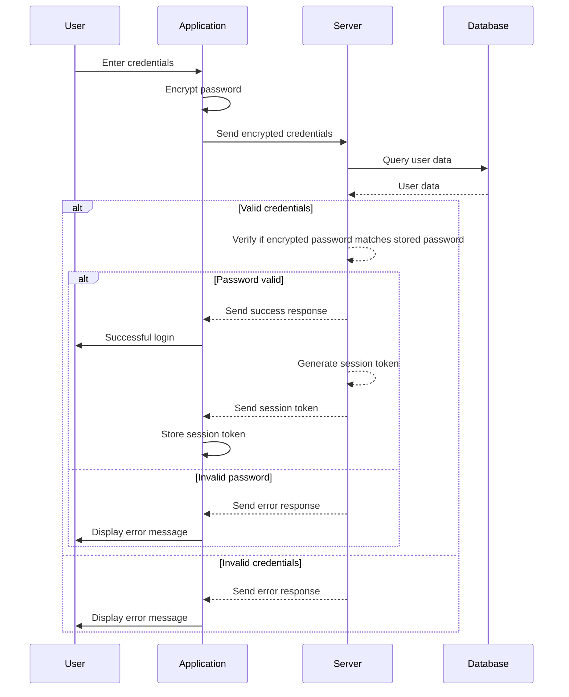
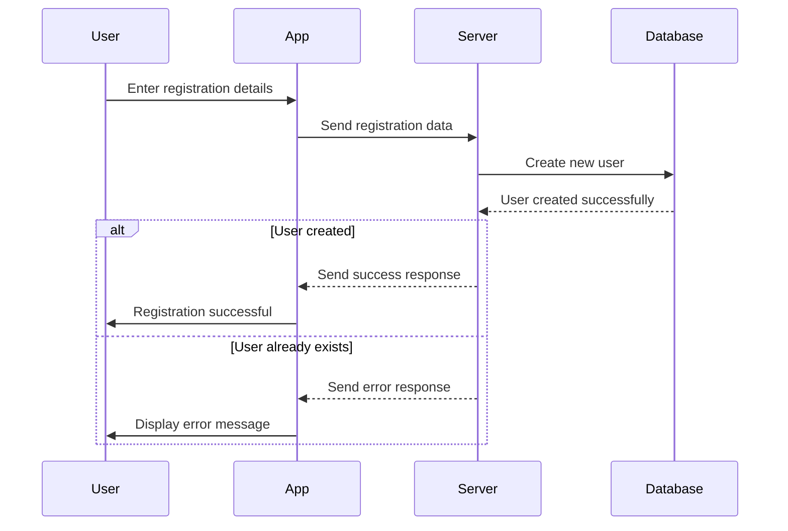
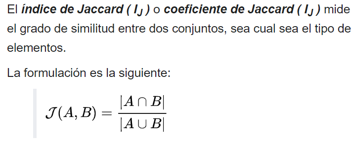

# located

Proyecto Modular

# How to execute http request to interact with the server?

- you need to have your server running that means in the located.api runs this command

```powershell
     nodemon app
```

- once your server is running you need to grab your ip running this command (use the ip v4)

```powershell
    ipconfig
```

- now just copy and paste that ip in your .env file of `locate` (`react native app`)

```
//before
    BASE_URL=http://localHost:8080
// after (this is the target result this may work)
    BASE_URL=http://<PASTE_YOUR_IP>:8080
// example
    BASE_URL=http://172.188.98.2:8080
```

### Notes

If you are having, because the BASE_URL is not updating, try this

- run the follow command

```powershell
    npm run reset-cache
```

- then finish that execution with `ctrl + c`
- now you can run again the project

# Http response codes

| Code | Meaning               | Description                                                                           |
| ---- | --------------------- | ------------------------------------------------------------------------------------- |
| 200  | OK                    | The request has been successful.                                                      |
| 201  | Created               | The request has been fulfilled, and a new resource has been created.                  |
| 204  | No Content            | The server has successfully processed the request, but there is no content to return. |
| 301  | Moved Permanently     | The requested resource has been permanently moved to a new location.                  |
| 304  | Not Modified          | The resource has not been modified since the last request.                            |
| 400  | Bad Request           | The server cannot process the request due to a client error.                          |
| 401  | Unauthorized          | The client must authenticate to get the requested response.                           |
| 403  | Forbidden             | The client does not have permission to access the requested resource.                 |
| 404  | Not Found             | The requested resource could not be found.                                            |
| 500  | Internal Server Error | An internal server error has occurred.                                                |
| 503  | Service Unavailable   | The server is temporarily unable to handle the request.                               |

# Ports of the projects

| Port  | Project                          | Service        |
| ----- | -------------------------------- | -------------- |
| 8080  | Located.Api                      | Node Js Server |
| 8081  | Mongo manager(in docker compose) | Mongo express  |
| 27017 | Mongo db (in docker compose)     | MongodB        |
| 8082  | Located                          | Metro          |

# `Diagram Google Sing up`



# `Log in user Flow`



# `Register user Flow`



# Módulo 1: **`Sistemas de Información`**

Este módulo está implícito en todo el proyecto, ya que abarca toda la parte de **`programación`** y **`bases de datos`**, además de **`estructuras de datos`**. En todo el proyecto, se distribuye este conocimiento, ya que utilizamos una gran variedad de estructuras de datos y principios básicos de programación.

# Módulo 2: **`Gestión de la Tecnología`**

Para este módulo, se implementaron diversas técnicas de **`ingeniería de datos`** y **`control de proyectos`** para realizar toda la **`planificación`** y **`seguimiento del desarrollo`**. Por ejemplo, se utilizó la metodología **`SCRUM`**, con **`historias de usuario`**, para definir tareas, bugs y epics. Además, para la **`gestión del desarrollo`**, utilizamos un **`SVC (System Version Control)`** llamado **`Git`**, para crear ramificaciones por historia, tarea y bug, y así mantener la integridad de los proyectos.

# Módulo 3: **`Sistemas Robustos, Paralelos y Distribuidos`**

En este módulo, se desarrolló una aplicación **`cliente-servidor`**. Por el lado del cliente, utilizamos **`React Native`** para desarrollar una aplicación móvil para **`Android`**, y por el lado del servidor, implementamos un servidor **`Node.js Express`**. También desarrollamos una página en **`React.js`** para las descargas del **`APK`**. El servidor se alojó en una **`PaaS`** que nos dio la oportunidad de configurar los puertos por los que escucharía nuestro servidor.

# Módulo 4: **`Cómputo Flexible`**

Para este módulo, decidimos incluir un clasificador de comentarios que analiza los **`sentimientos`** transmitidos en un comentario, ya sea **`positivo`**, **`negativo`** o **`neutro`**, utilizando el algoritmo de **`Naive Bayes`**. Realizamos un proceso de **`ETL`** en un conjunto de datos para lograr una clasificación precisa. Además, se agregó un algoritmo para realizar **`recomendaciones de locales`**, teniendo en cuenta la interacción del usuario con la aplicación y utilizando el **`Coeficiente de Jaccard`** para extraer usuarios más parecidos.

# Formulas

## Naive Bayes


## Jaccard



## Haversine


