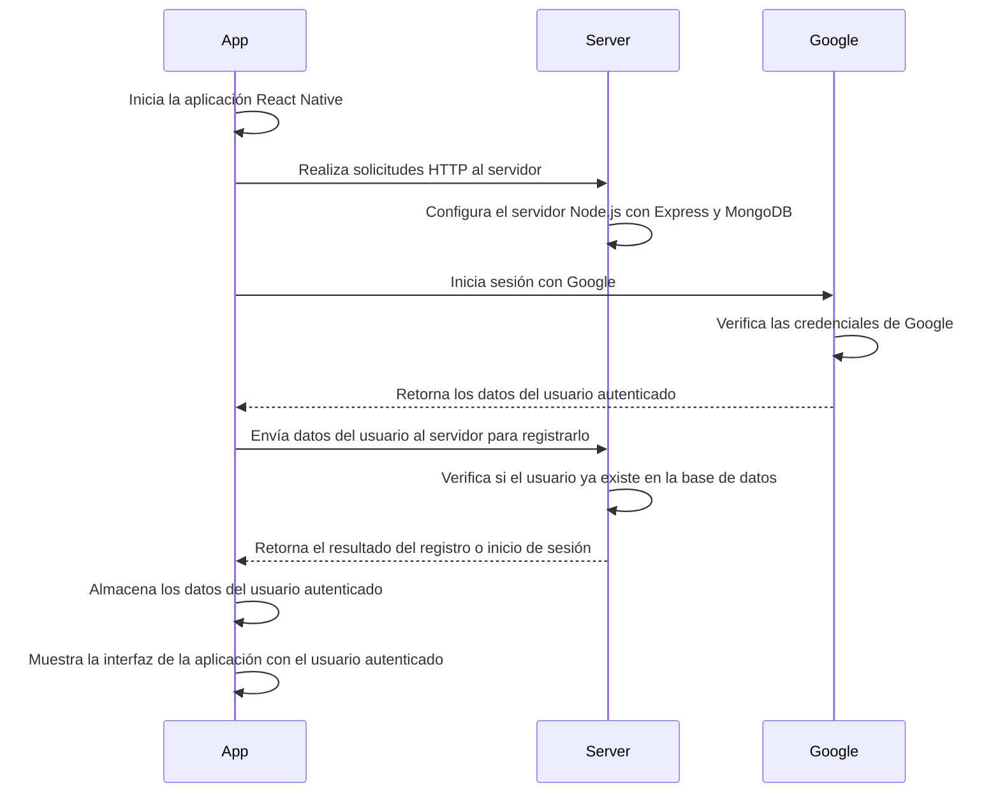
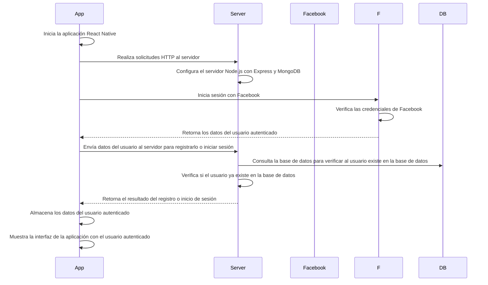

# located

Proyecto Modular

# How to execute http request to interact with the server?

- you need to have your server running that means in the located.api runs this command

```powershell
     nodemon app
```

- once your server is running you need to grab your ip running this command (use the ip v4)

```powershell
    ipconfig
```

- now just copy and paste that ip in your .env file of `locate` (`react native app`)

```
//before
    BASE_URL=http://localHost:8080
// after (this is the target result this may work)
    BASE_URL=http://<PASTE_YOUR_IP>:8080
// example
    BASE_URL=http://172.188.98.2:8080
```

### Notes

If you are having, because the BASE_URL is not updating, try this

- run the follow command

```powershell
    npm run reset-cache
```

- then finish that execution with `ctrl + c`
- now you can run again the project

# Http response codes

| Code | Meaning               | Description                                                                           |
| ---- | --------------------- | ------------------------------------------------------------------------------------- |
| 200  | OK                    | The request has been successful.                                                      |
| 201  | Created               | The request has been fulfilled, and a new resource has been created.                  |
| 204  | No Content            | The server has successfully processed the request, but there is no content to return. |
| 301  | Moved Permanently     | The requested resource has been permanently moved to a new location.                  |
| 304  | Not Modified          | The resource has not been modified since the last request.                            |
| 400  | Bad Request           | The server cannot process the request due to a client error.                          |
| 401  | Unauthorized          | The client must authenticate to get the requested response.                           |
| 403  | Forbidden             | The client does not have permission to access the requested resource.                 |
| 404  | Not Found             | The requested resource could not be found.                                            |
| 500  | Internal Server Error | An internal server error has occurred.                                                |
| 503  | Service Unavailable   | The server is temporarily unable to handle the request.                               |

# Ports of the projects

| Port  | Project                          | Service        |
| ----- | -------------------------------- | -------------- |
| 8080  | Located.Api                      | Node Js Server |
| 8081  | Mongo manager(in docker compose) | Mongo express  |
| 27017 | Mongo db (in docker compose)     | MongodB        |
| 8082  | Located                          | Metro          |

# Diagrama Google


# Diagrama Facebook




