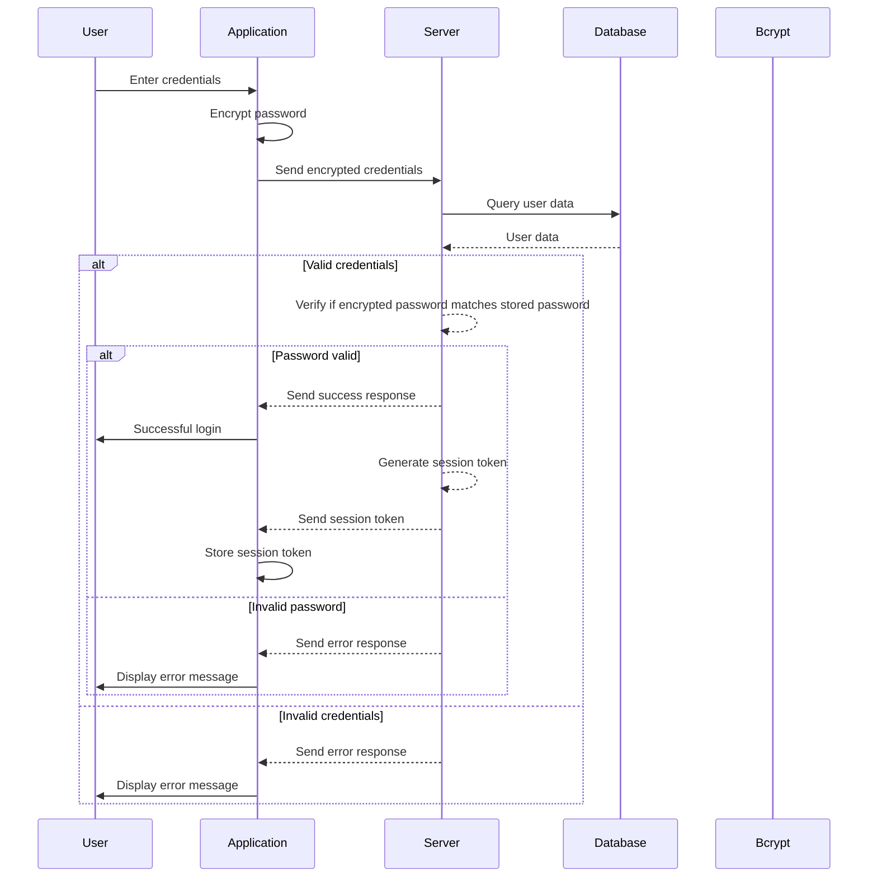
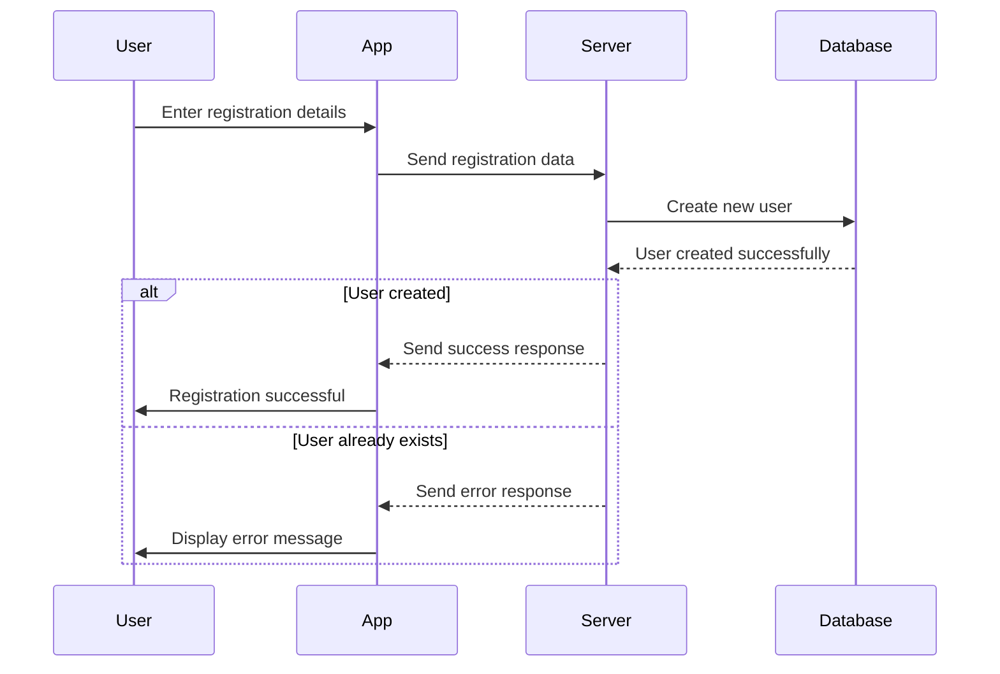

## `Log in user Flow`

```mermaid
sequenceDiagram
    participant User as User
    participant App as Application
    participant Server as Server
    participant Database as Database
    participant Bcrypt as Bcrypt

    User->>App: Enter credentials
    App->>App: Encrypt password
    App->>Server: Send encrypted credentials
    Server->>Database: Query user data
    Database-->>Server: User data

    alt Valid credentials
        Server-->>Server: Verify if encrypted password matches stored password
        alt Password valid
            Server-->>App: Send success response
            App->>User: Successful login
            Server-->>Server: Generate session token
            Server-->>App: Send session token
            App->>App: Store session token
        else Invalid password
            Server-->>App: Send error response
            App->>User: Display error message
        end
    else Invalid credentials
        Server-->>App: Send error response
        App->>User: Display error message
    end
```

## `Register user Flow`

```mermaid
sequenceDiagram
    participant User
    participant App
    participant Server
    participant Database

    User->>App: Enter registration details
    App->>Server: Send registration data
    Server->>Database: Create new user
    Database-->>Server: User created successfully

    alt User created
        Server-->>App: Send success response
        App->>User: Registration successful
    else User already exists
        Server-->>App: Send error response
        App->>User: Display error message
    end
```
